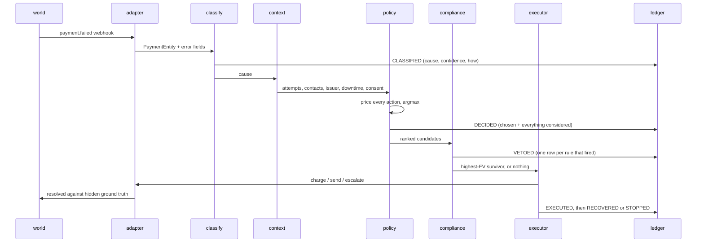

# Architecture

How Recoup is put together, and what each boundary is protecting.

[README.md](README.md) has the result. [DECISIONS.md](DECISIONS.md) has the
alternatives that were rejected. [FAILURES.md](FAILURES.md) has the eleven things
this got wrong. This describes the shape.

About 10,500 lines of Python, 7,200 of tests, 3,900 of CSS and 2,900 of templates.
No npm, no build step, no services to stand up.

---

## The shape

```
┌─ world/ ─────────────────────────────────┐
│  generator · issuers · customers          │  ALL ground truth lives here
│  outcomes · clock                         │  and only here
└───────────────────┬───────────────────────┘
                    │
        webhook-shaped events only   ◄── THE WALL (AST test, enforced in CI)
                    │
┌───────────────────▼───────────────────────┐
│  adapters/   one Protocol, two impls      │
│  simulated.py          razorpay_test.py   │  ◄── the same agent runs against
└───────────────────┬───────────────────────┘      real Razorpay test mode
                    │
┌───────────────────▼───────────────────────┐
│  agent/                                   │
│    classify   symptoms → cause            │
│    context    history, issuer, downtime   │
│    policy     EV over every action        │
│    compliance hard rules, veto only       │  ◄── runs AFTER policy,
│    executor   the only code touching money│      can only subtract
│    llm/       5 batched calls per run     │
└───────────────────┬───────────────────────┘
                    │
┌───────────────────▼───────────────────────┐
│  ledger/    append-only, SQLite triggers  │  ◄── every screen is a fold
│             7 event kinds, hashed         │      over this
└───────────────────┬───────────────────────┘
                    │
        ┌───────────┴────────────┐
        ▼                        ▼
┌─ eval/ ──────────┐   ┌─ web/ ─────────────┐
│ 4 arms           │   │ 7 screens          │
│ ablation         │   │ FastAPI + Jinja2   │
│ 15-point sweep   │   │ reads run.db       │
│ reproduce        │   │ never computes     │
└──────────────────┘   └────────────────────┘
```

The dependency arrows point one way. `world` knows nothing about `agent`; `agent`
knows nothing about `world`; `eval` and `web` know about both but neither knows
about them.

---

## One payment, end to end

The concrete path. Every arrow here is a function call you can follow in the code.



Four things worth noting in that sequence.

**Classification happens before context, and context before pricing.** The policy
cannot price an action without knowing the cause, and the cause is assigned once
per payment and recorded. A payment whose cause could not be determined is priced
under a pessimistic default rather than skipped.

**The policy proposes a ranked list, not a single action.** `compliance` walks it
in order and returns the first survivor. That is why a veto degrades to the next
best option instead of to inaction — the failure mode a naive gate has.

**Vetoes are written whether or not anything was executed.** They are the refusal
list, which is a deliverable in its own right: 903 refusals on the committed seed,
grouped by rule.

**The executor is the only module that touches money or customers.** It decides
nothing. Everything it does is a call through the adapter protocol or a row in the
ledger.

---

## Four boundaries, and what enforces each

An architecture document that lists boundaries is describing intentions. These are
the mechanisms that make them true, and the test that fails if one is removed.

### 1. The wall — `tests/test_no_ground_truth_leak.py`

The simulator knows whether a payment was always going to succeed. If the agent
could see that, every number this project reports would be meaningless.

So `recoup/agent/**` may not import `recoup.world`. This is not a convention: the
test AST-parses every module under `recoup/agent/` and fails the build on any
import of the forbidden root. It runs in CI on every push.

`recoup/adapters/` is deliberately exempt — the simulated adapter *is* the seam and
must import the world. The agent talks to the protocol.

### 2. The adapter seam — `recoup/adapters/base.py`

Two protocols, deliberately split by what they touch:

- `PaymentsAdapter` — everything that touches money: `fetch_payment`,
  `attempt_charge`, `create_recovery_link`, `active_downtimes`
- `Notifier` — everything that touches a customer: `send`, `consented_channels`,
  `preferred_language`

`SimulatedAdapter` and `RazorpayTestAdapter` implement the first. The agent cannot
tell which it is running against, which is what makes "this would work in
production" a structural claim rather than an aspiration.

`consented_channels` and `preferred_language` live on `Notifier` rather than
somewhere in the agent because both are merchant-held profile facts. In production
they come from the messaging provider; putting them here means the compliance gate
can check consent without the agent reaching around the seam.

**Live mode is structurally impossible.** `RazorpayTestAdapter.__init__` raises
`TestModeViolation` unless the key ID starts with `rzp_test_`. Not a default — a
constructor that refuses to exist. KYC on the Razorpay account was deliberately
left incomplete, so live keys cannot be issued at all. Two independent barriers.

### 3. The compliance gate — `recoup/agent/compliance.py`

Runs *after* the policy and can only subtract. Compliance is never a term inside
the expected-value sum, because a rule expressed as a cost is a rule with a price,
and a large enough payment will outbid it. Quiet hours are not worth ₹40,000.

Each rule is a named method returning `Veto | None`, listed individually rather
than driven from a table, so deleting one is a visible act in a diff. Every rule
has a test in `tests/test_compliance.py`.

Config keys that name something in code are validated at load time. `hard_stops`
was once keyed on `MANDATE_REVOKED` — a Razorpay *reason* string, not a taxonomy
*cause* — so the lookup missed, returned `None`, and the gate waved the retry
through. The rule read correctly, parsed, validated, and did nothing. Now a key
naming an unknown cause refuses to load.

### 4. The LLM boundary — `recoup/agent/llm/`

Five batched calls per run, roughly 8,300 tokens total. Every one of them is a
*fallback*: something the deterministic path could not do. So `LLMClient.structured`
returns `None` rather than raising on malformed output, and every caller degrades to
deterministic behaviour. A recovery agent that stops recovering because a model
returned bad JSON has the failure mode backwards.

| Call | What it does | If it fails |
|---|---|---|
| `classify-unresolved` | every unmapped symptom in the run, in one request | pessimistic unknown-cause default |
| `nudge-copy-{en,hinglish,hi}` | 7 causes × 4 channels per language | hand-written templates |
| `case-explanations` | the selected cases, in one request | explanation composed from the same facts |

Responses are content-addressed and committed to `cache/llm/`, so the reported
numbers reproduce with no key and no network. The **AI Calls** screen renders that
directory and re-validates every output on load.

Two output rules, arrived at from opposite directions:

- **Copy: the model never sees a number.** It writes `{amount}`; code substitutes at
  send time. A model that cannot see an amount cannot state the wrong one.
- **Explanations: the model may only echo numbers it was given.** Every digit run in
  a generated explanation must appear in that case's brief.

---

## The ledger is the spine

`recoup/ledger/events.py`. One SQLite table, seven event kinds, append-only.

```sql
CREATE TABLE ledger (
    seq INTEGER PRIMARY KEY AUTOINCREMENT,
    at TEXT, kind TEXT, arm TEXT,
    payment_id TEXT, customer_id TEXT, amount INTEGER, data TEXT
);
CREATE INDEX ledger_payment ON ledger (arm, payment_id, seq);
CREATE INDEX ledger_kind    ON ledger (arm, kind, seq);

CREATE TRIGGER ledger_no_update BEFORE UPDATE ON ledger
BEGIN SELECT RAISE(ABORT, 'ledger is append-only'); END;
CREATE TRIGGER ledger_no_delete BEFORE DELETE ON ledger
BEGIN SELECT RAISE(ABORT, 'ledger is append-only'); END;
```

`OBSERVED → CLASSIFIED → DECIDED → (VETOED) → EXECUTED → RECOVERED | STOPPED`

Two triggers cost four lines and turn a convention into a guarantee that survives
refactors. The alternative — mutable per-payment rows plus a log table — makes the
state the truth and the log a description of it, which can drift.

**Every screen is a fold over this table.** The case view is `story_of(payment_id)`;
the refusal list is a filter on `VETOED`; the queue is a single ordered scan folded
to one row per payment. The two indexes were built for auditability and turned out
to be exactly what the read path needed.

**Each arm's stream is hashed when written.** The Audit screen re-hashes on load and
compares, so "this is an audit trail" is a property you can check in front of the
person asking, not a claim in a README.

**What is deliberately not stored.** Three fields were removed after measuring what
the ledger actually contained; together they were ~45% of the file. `vetoes` inside
`DECIDED` duplicated the `VETOED` rows. `at` duplicated the row's own timestamp.
`reason` was an English sentence derivable entirely from `breakdown`, so it is
regenerated at read time by the same `explain()` the write path uses — which also
means the two paths cannot drift into describing one decision differently.

---

## Measurement

`recoup/eval/`. This is the half of the project that makes the other half a claim
rather than a demo.

**Four arms, one world.** `naive_baseline` (fixed retry, what merchants do),
`contact_only` (message everyone, reason about nothing), `recoup_agent`, and
`recoup_agent_no_llm`. The world is generated once; every arm sees the same
failures in the same order.

**Common random numbers.** Outcomes are drawn from `(seed, payment_id, attempt)`,
so two arms making the same decision get the same result. Independent streams per
arm — the default, and subtly wrong — would let a lift be either a policy
difference or a sampling difference, with no way to tell which without many more
runs.

**Two holdouts, because one flatters.** `contact_only` exists solely to split the
lift into coverage (67.7%) and judgment (32.3%). Without it the whole figure reads
as the policy engine's work.

**The ablation is an arm, not an argument.** `recoup_agent_no_llm` differs only in
the classifier fallback. It measured −₹238, and that is what is reported.

**The sweep re-runs everything.** `recoup sweep` moves each load-bearing assumption
to both ends of a plausible band and runs the full evaluation at each — 15 points,
about twenty minutes. Committed to `reports/sensitivity.json`. A test asserts every
axis actually mutates something, after one axis scaled a field the agent never
reads and reported a confident swing of exactly ₹0.

**`recoup reproduce` is the regression test for the claim.** It re-runs the
committed seed and compares 37 recorded figures — every README headline plus a
SHA-256 digest of each arm's complete event stream — against `reports/claims.json`,
exiting non-zero on any difference. A matching digest means every decision was
identical in the same order, which is stronger than matching totals: two runs can
recover the same amount having done different things.

**The runner has its own ceiling.** `MAX_DECISIONS_PER_PAYMENT = 12`, independent
of the compliance caps, so a bug in those caps becomes a bounded anomaly rather
than an unbounded loop. It also carries a decision to its scheduled moment rather
than re-deriving it — re-deciding at the scheduled time proposes another future
time, and the baseline once deferred its first retry forever and recovered ₹0.

---

## The web layer

`recoup/web/`. FastAPI + Jinja2, hand-authored CSS, six small inline scripts. No
npm, no framework, no build step: anything between `git clone` and a running
product is a cost with no benefit.

**Read path and write path are separate.** A full evaluation takes ~35 seconds and
a page load cannot. `recoup demo` computes the run once and writes `data/run.db`
plus `data/run.json`; every screen is a query against those. Policy Studio, which
genuinely needs a fresh run, does it as a background job with progress.

Caching's hard problem is invalidation, and this data deletes it: a run is
deterministic given a seed, identical for every viewer, and frozen once produced.
There is never a reason to throw it away, so there is no invalidation logic to get
wrong.

The scrubber takes the same argument one step further. `replay.state_at` folds the
stream up to a timestamp, which is O(events) per call — fine for one moment, wrong
for a slider that wants two hundred of them faster than a hand can move. So all 200
frames are folded in a single pass at `demo` time, written to `data/frames.json`
(16KB), and embedded in the page. Scrubbing is then an array lookup with no request
in it, which is the difference between a control that feels like an instrument and
one that feels like a form.

| Screen | Reads | Shows |
|---|---|---|
| Landing (`/`) | `run.json` + ledger | the claim, decomposed, with every figure read from the run |
| Control Room (`/control`) | `run.json` + `frames.json` | the scoreboard, and thirty days replayable on a slider |
| Recovery Queue | ledger scan | every failure, filterable |
| Case Detail | `story_of` | timeline, EV arithmetic as a checkable sum, the message sent, the plain-language version |
| Policy Studio | background job | change a cost, re-run, watch the number move |
| Audit & Refusals | `VETOED` + digest | the ledger, verified live, and every refusal by rule |
| Experiment | `run.json` + sweep | arms, ablation, tornado |
| AI Calls | `cache/llm/` | every prompt and response, each output re-validated on load |

---

## Degradation

What happens when something is missing, in every case that can arise.

| Missing | Behaviour |
|---|---|
| No API key | cached responses replay; all reported numbers reproduce |
| No key *and* no cache | every LLM path degrades to its deterministic fallback; the run completes |
| A provider 5xx | retried once on the same provider, then the next provider, then fallback |
| Malformed model output | one salvage attempt at extracting JSON, then `None`, then fallback |
| No `data/run.db` | screens render an empty state with the command to fix it, not a 500 |
| No `data/frames.json` | rebuilt from the ledger on load; only the page gets slower |
| JavaScript disabled | the replay card ships `hidden` and is never revealed; every other figure is server-rendered |
| No `cache/llm/` | AI Calls says so rather than showing zero |
| No Razorpay key | the live adapter is never constructed; the simulated one is unaffected |
| A live key | `TestModeViolation` at construction |

The through-line: **nothing in the recovery path may depend on a network service
being reachable.** Every model call has a hand-written fallback, and a test holds
those fallbacks to the same validator the model's output passes.

---

## Where to start reading

| If you want to check… | Read |
|---|---|
| that the numbers are not self-graded | `tests/test_no_ground_truth_leak.py` |
| the decision arithmetic | `recoup/agent/policy.py`, then any case on Case Detail |
| that compliance cannot be outbid | `recoup/agent/compliance.py` + `config/compliance.yaml` |
| that the agent is portable | `recoup/adapters/base.py`, then `razorpay_test.py` |
| that the result reproduces | `python -m recoup reproduce` |
| what the model was actually asked | `cache/llm/`, or the AI Calls screen |
| what this got wrong | [FAILURES.md](FAILURES.md) |

531 tests. `pytest` runs them in about five minutes with no network and no keys.
